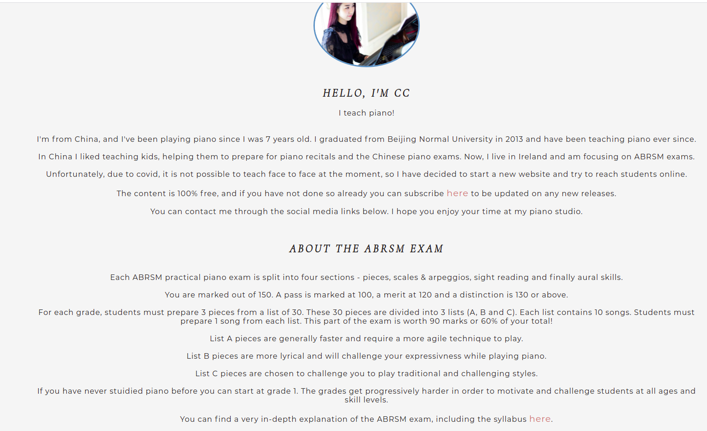

# ABRSM Piano Studio

This site is for piano students preparing for ABRSM exams. The ABRSM is an awarding body that holds graded music exams for many instruments. Every year over 600000 students sit these exams; 120000 of these are piano students. 

Students are required to prepare 3 pieces for their exam. This website deals with this requirement.

Piano students can use this site to watch a professional musician play the pieces. See correct fingerings and get access to helpful tips and pdfs of the lessons for free. 

The site is aimed at all ages. Children and teenagers make up a lot of ABRSM students. I tried to keep text to a minimum to keep the site uncluttered and keep navigation simple.

The site deals with the practical requirement that students must prepare 3 pieces. It is worth 60% of the exam. In terms of an MVP to launch the site, I determined the site needs at least 3 songs in one of the grades to be useable. 

It is a living site as to update the site with at least 3 videos a week would take almost a year. I am happy the structure of the lesson page is ready so the site owner can continue to update the site by themselves.
 
 

 
 

# Features

## Existing Features

 Nav Bar 
- In keeping with the theme of the website the navbar is in the style of a piano. Each white key is a fully functional navigation link. It is the same on each page and will allow users to easily navigate the site. It links to the home page, lesson landing page, and the about page. 
 
 

At smaller screen widths, the piano makes the navbar look too cluttered, so a new smaller, sleeker nav bar will appear in its place to compensate for this. It is also fully functional and provides the same links. It is the same on each page. 

 
 
Home page image 

- The home page hero image has a great animation that I feel shows the philosophy of the website very well. It will begin on the piano and gradually move to the right to focus on the student. I did not like this effect so much at smaller screen widths, and so on mobile devices, the image is static. 

 
 
Site philosophy and ethos section

- This section of the home page uses 3 boxes to convey the basic ethos of the website. The center box is a dark pink taken from the hero image. I put this color into the adobe color wheel and selected triad to get another 2 complimentary colors. The left is a green and the right is a blue.
- The information in the left box links to the about section. The right box links to the lesson landing page. The center box lets the user subscribe for notifications on future lessons. 
- The 3 boxes aim to reinforce the idea that the content is free and regular. It also allows the user to navigate without scrolling back up. They are responsive.

Footer

- The footer section is very straightforward and includes links to youtube, Facebook, and Twitter. It aims to give the teacher on the website more exposure on the internet. 

Lesson Landing Page
- information is provided for students that are unfamiliar with the exam structure. It is a link to the about section. I found this the best way to keep as much of the website clutter-free from too much text for younger users. It also gives another opportunity to subscribe by linking back to the box on the home page.
- 3 boxes with the same colors already seen on the homepage with links to the grade and specific song list to make navigating to the page the student needs easier and as painless as possible. There is a hover shadow effect on these boxes also. For color consistency, I added 2 yet to be published lessons. In the future it would be a good idea to keep this consistent by having boxes that say coming soon, which also reinforces the idea that content is regular, the site is living, and that students should subscribe. 

Lesson page 

side nav bar & directory folder 

- The sidebar gives a good layout and access to any lesson the user wishes to navigate to. The directory also tells the user exactly where they are, this also links back to the lesson landing page. Very useful for smaller screen width when the side navbar will not be displayed.

Lesson main content
- The layout will be the same in all future lessons. There is information about the composer, then a video of the piece, underneath there are examples and exercises to practice, finally a link to an external pdf. It has its own scrollbar to keep the content the same length as the sidebar. 

Next & Previous buttons 

- simple responsive buttons meant to make navigation easier especially at smaller screen widths when the lesson sidebar is gone. Also keeps coloring consistent. 

About page

The about page is very simple and has the bulk of text on the website. It is meant to give a friendly introduction to the teacher with profile pic and info. It also has a summary of exam requirements and an external link to the official website of ABRSM. The language is kept as simple as possible in case kids want to read it but it is primarily meant for adults, especially parents.

Features left to implement 

- livestream page. It is a good way to keep content relevant on the site but is too much work when the core video lessons are not completed. To record every song at a minimum of 3 a week would take most of the year. 
- interactive navbar. I would like to have burger icons and nav bars that can expand when needed to be used but I don't have the skills for this yet. This would make the lesson page much easier to navigate although I feel I have done a good job at making it accessible for the time being. When content grows this would be essential. 
- video exchange and sign-ins. This would be a great way for students to interact with the teacher. Upload their own videos and get a reply from the teacher. It is just not feasible at the moment because I don't know how to make a site that students can log into and have access to, let alone upload videos. 
- I would love to make the pictures in the lesson content expand for smaller screens when pressed/clicked.  

# Wireframes

I am very happy that most of what I had in mind for the wireframes came to fruition. The advice from my mentor Precious was my sign-up page was a subscribe feature and that I should move it to the home page. I also only needed an email input for that. I feel this change helped the site and made the idea I had for the 3 boxes on the homepage even more impactful by becoming the subscribe box. 

The old sign-up page became an about section which I think is also very important for the website as it allowed me to keep the rest of the site clutter-free from text which I think will help younger users navigate the site a lot easier. 

Here are links to the wireframes:

[Desktop](assets/pdf/project_1_computer.pdf)

[Tablet](assets/pdf/project_1_tablet.pdf)

[Phone](assets/pdf/practice_pieces_phone.pdf)

# User Stories 

## Students

"As a student, I want to find relevant material for what I am studying, so that I can get help
preparing for my exam." - The lesson content is up to date with current 2021/2022 syllabus. New content to be added on a weekly basis. 

"As a student, I want access to 100% free good quality content, so that I can continue to take
lessons with my teacher." - All content is 100% free and makes no attempt to coax students from their current teachers.

"As a student, I want access to PDFs of lessons so I can print them and practice in my own time." - All lessons published have an external pdf to the lesson content.

"As a student, I want to be kept up to date about new releases and changes in the exam syllabus
so that I can make sure what I am studying is relevant." - Every page presents students to subscribe to be kept up to date with the site with a simple email input.

"As a student, I want short videos, concise lessons so the point of the lesson does not get lost in
endless lectures by the teacher." Videos are kept short and to the point. They can be rewatched as often as needed. Text is kept to a minimum in an effort to be short and succint. 

"As a student I want more than just what to play, I want exercises to help me play the pieces
better." - Each lesson comes with commentary from a teacher who knows and teaches the material as a profession. The teacher chose these specific problems as they come up with many students. 

"As a parent I want a safe space for my child to learn so that I don’t worry they are looking at
inappropriate content or listening to foul language." - The teacher of the site teaches mostly children and is a mother herself. She has also double checked to make sure all content is appropriate, friendly and safe. 

"As a parent I want my child to have access to free content from a nice teacher as music lessons
are extremely expensive." - users are encouraged to get in contact with the teacher if they so wish. Every attempt is made to make sure language is age nuetral and friendly.

"As a teacher I want a website to recommend to my students that is relevant to what I teach in
class so that they will have different perspectives, structured practice time, and a better chance
of passing which will reflect positively on my own teaching experience." - The website is a great reference for homework and makes no attempt to lure students away from teachers. 

"As a teacher, I want ideas that I can bring to my lessons because I don't always have time to
prepare." Each lesson exercise can be expanded upon in a live classroom and provide many great foundations for lesson plans. 100% free for teachers also.

"As a music school, we want a reliable, living website we can refer students to so that they can
have extra practice at home so that they will get help passing exams which will reflect well on
our school." - The site is up to date with current syllabus and the teacher on the site wishes to use as her own personal website in the future to release weekly content. The aim of the website is to help students get top marks for their pieces which are worth 60%  of the exam.

# Testing 

The hardest thing to get working on this site was the boxes and piano navbar. It was very difficult to have everything centered and responsive. I discovered flexbox and it helped with this. Also having different layouts for the site on mobile and tablet was a lot of extra work but helped keep the site consistently smooth and responsive. 

I had to include a lot of media queries to get the site responsive enough but I feel it was worth the effort. 

The piano nav bar had a bug that was very difficult to fix. the whitespace to the right of it was clickable and wouldn't click back to the home page. I managed to fix this by making the home button position relative even though I didn't move it. 

There was also a lot of whitespace leftover on the right-hand side of the website. I dealt with this by hiding the overflow. It made positioning other elements at lower screen widths very tedious and difficult but it was worth the effort as the site is very responsive now. 

The site was tested on Google Chrome - Mozilla Firefox - Safari - Opera - All without issue. 

## Validator testing 

HTML 

No errors on W3 validator
- [Home](https://validator.w3.org/nu/?doc=https%3A%2F%2Fxiaoniuniu89.github.io%2FABRSM_piano_studio%2Findex.html)
- [Lesson Landing](https://validator.w3.org/nu/?doc=https%3A%2F%2Fxiaoniuniu89.github.io%2FABRSM_piano_studio%2Flesson-landing-page.html) 
- [Lesson](https://validator.w3.org/nu/?doc=https%3A%2F%2Fxiaoniuniu89.github.io%2FABRSM_piano_studio%2Fgrade1-minuet.html)
- [About](https://validator.w3.org/nu/?doc=https%3A%2F%2Fxiaoniuniu89.github.io%2FABRSM_piano_studio%2Fabout.html)

CSS

No errors on the W3C jigsaw validator

## Unfixed bugs 
To my knowledge, everything works as it should. The next and previous buttons, small screen width nav bar, and logo do not move so smoothly in dev tools as you make the screen width lower and lower - I had to do this through lots of media queries - In any case, I intend to maintain the site in the future after it has been assessed with any new skills I gain. 

# Deployment 

The site is deployed on git hub pages. The link is here:

https://xiaoniuniu89.github.io/ABRSM_piano_studio/

The steps for deploying the site are as follows. 

- In the GitHub repository go to the settings tab. 
- on the side navigation bar scroll to pages (second last option)
- under source select main and click save 
- The page will refresh with a blue background message that says the page is deployed and provide a link. If the message reads ready to be deployed, wait a few minutes and refresh the page. 

# Credits 
- My mentor Precious gave me such good advice on this project. His advice about wireframes is a habit I will bring into future projects. His advice about checking for responsiveness as soon as I code a new feature was invaluable and saved soo many potential problems. 

- My wife Chenyang (CC) for playing the piano, recording the videos, and coming up with some simple exercises for the pieces. I'm happy the content is personal and made with love. She also switched to a full-time career for our two-year-old son so I could have time to put work into the course and website and without her I could not do this at all. 

## Aesthetics 

The feel and look of the site was influenced a lot by the love running project (home page and hero image idea) and also from an educational site by a man named Mike Dane. His layout of his lesson pages influenced my site alot.

https://www.mikedane.com/web-development/html/choosing-a-text-editor/

## Content 
- The next and previous buttons were written by following a lesson from w3 schools https://www.w3schools.com/howto/howto_css_next_prev.asp
- I learned about and implemented the flexbox features on my site from a Mike Dane lesson https://www.mikedane.com/web-development/css/flexbox/
- the images on the home page boxes and along footer are from [font awesome](https://www.fontawesome.com)

## Media

All videos and pdfs and images for the lessons were shot/made by my wife or myself and edited by me also. The scores were all written by either myself or my wife. 

Applications used: 

- [Chordie](https://www.chordieapp.com/) for piano digital display 
- Imovie to edit videos 
- [musescore](https://musescore.org/) For writting music scores
- https://www.iloveimg.com/crop-image for cropping images 

The hero image on the homepage was taken from the Unsplash website.

https://unsplash.com/photos/K7HEuGfJFIM

