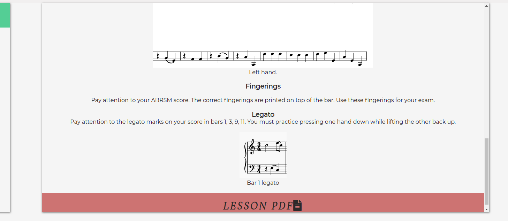

# ABRSM Piano Studio

This site is for piano students preparing for ABRSM exams. The ABRSM is an awarding body that holds graded music exams for many instruments. Every year over 600000 students sit these exams; 120000 of these are piano students. 

Students are required to prepare 3 pieces for their exam. This website deals with this requirement.

Piano students can use this site to watch a professional musician play the pieces. See correct fingerings and get access to helpful tips and pdfs of the lessons for free. 

The site is aimed at all ages. Children and teenagers make up a lot of ABRSM students. I tried to keep text to a minimum to keep the site uncluttered and keep navigation simple.

The site deals with the practical requirement that students must prepare 3 pieces. It is worth 60% of the exam. In terms of an MVP to launch the site, I determined the site needs at least 3 songs in one of the grades to be useable. It has 6 at the moment spanning grade 1 and 2. It should give the assessor a good idea of what the site would look like after 1 year of uploading content.

It is a living site as to update the site with at least 3 videos a week would take almost a year. I am happy the structure of the lesson page is ready so the site owner can continue to update the site by themselves.

The site is deployed on git hub pages. The link is here:

https://xiaoniuniu89.github.io/ABRSM_piano_studio/
 
 

 
 

# UX Design
A simple layout free from too much text to appeal to a broad range of ages. 
- A home page that includes links in the header and at the bottom of the page to allow users access to any of the main pages from any point on the page. It includes sections about how to subscribe, about the teacher and about the exam itself. 

- A lesson landing page to provide neat navigation to what could easily become an unruly mess due to the amount of content that will eventually be on the site. Each grade has its own box with a song list hyperlink. 

- a very simple about page. Information about the teacher and the exam can be found here and it is where the bulk of text on the main 3 pages can be found. 

# User Journey

 Home Page
- In keeping with the theme of the website the navbar is in the style of a piano. Each white key is a fully functional navigation link. It is the same on each page and will allow users to easily navigate the site. It links to the home page, lesson landing page, and the about page. 
 
 

At smaller screen widths, the piano makes the navbar look too cluttered, so a new smaller, sleeker nav bar will appear in its place to compensate for this. It is also fully functional and provides the same links. It is the same on each page. 

 
 
- The home page hero image has a great animation that I feel shows the philosophy of the website very well. It will begin on the piano and gradually move to the right to focus on the student. I did not like this effect so much at smaller screen widths, and so on mobile devices, the image is static. 

 
 
- This section of the home page uses 3 boxes to convey the basic ethos of the website. The center box is a dark pink taken from the hero image. I put this color into the adobe color wheel and selected triad to get another 2 complimentary colors. The left is a green and the right is a blue.
- The information in the left box links to the about section. The right box links to the lesson landing page. The center box lets the user subscribe for notifications on future lessons. 
- The 3 boxes aim to reinforce the idea that the content is free and regular. It also allows the user to navigate without scrolling back up. They are responsive.

- The footer section is very straightforward and includes links to youtube, Facebook, and Twitter. It aims to give the teacher on the website more exposure on the internet. 

Lesson Landing Page

- information is provided for students that are unfamiliar with the exam structure. It is a link to the about section. I found this the best way to keep as much of the website clutter-free from too much text for younger users. It also gives another opportunity to subscribe by linking back to the box on the home page.

- 3 boxes with the same colors already seen on the homepage with links to the grade and specific song list to make navigating to the page the student needs easier and as painless as possible. There is a hover shadow effect on these boxes also. For color consistency, I added 2 yet to be published lessons. In the future it would be a good idea to keep this consistent by having boxes that say coming soon, which also reinforces the idea that content is regular, the site is living, and that students should subscribe. 

Lesson page 

- The sidebar gives a good layout and access to any lesson the user wishes to navigate to. The directory also tells the user exactly where they are, this also links back to the lesson landing page. Very useful for smaller screen width when the side navbar will not be displayed.

- The layout will be the same in all future lessons. There is information about the composer, then a video of the piece, underneath there are examples and exercises to practice, finally a link to an external pdf. It has its own scrollbar to keep the content the same length as the sidebar. 

Next & Previous buttons 

- simple responsive buttons meant to make navigation easier especially at smaller screen widths when the lesson sidebar is gone. Also keeps coloring consistent. 

About page

- The about page is very simple and has the bulk of text on the website. It is meant to give a friendly introduction to the teacher with profile pic and info. It also has a summary of exam requirements and an external link to the official website of ABRSM. The language is kept as simple as possible in case kids want to read it but it is primarily meant for adults, especially parents.

# User Stories 

- As a student, I want to find relevant material for what I am studying, so that I can get help
preparing for my exam.  

- As a student, I want access to 100% free good quality content, so that I can continue to take
lessons with my teacher.

- As a student, I want access to PDFs of lessons so I can print them and practice in my own time.

- As a student, I want to be kept up to date about new releases and changes in the exam syllabus
so that I can make sure what I am studying is relevant.

- As a student, I want short videos, concise lessons so the point of the lesson does not get lost in
endless lectures by the teacher.

- As a student I want more than just what to play, I want exercises to help me play the pieces
better.

- As a parent I want a safe space for my child to learn so that I don’t worry they are looking at
inappropriate content or listening to foul language.

- As a parent I want my child to have access to free content from a nice teacher as music lessons
are extremely expensive.

- As a teacher I want a website to recommend to my students that is relevant to what I teach in
class so that they will have different perspectives, structured practice time, and a better chance
of passing which will reflect positively on my own teaching experience.

- As a teacher, I want ideas that I can bring to my lessons because I don't always have time to
prepare.

- As a music school, we want a reliable, living website we can refer students to so that they can
have extra practice at home so that they will get help passing exams which will reflect well on
our school.

The users goals are all met by the website. A student can go online and find up to date lesson content, lesson PDFs and are given many chances to subscribe for new content.

Parents need not worry. The lessons are free, there is no mature content on the site and they can contact the teacher if they so wish. 

schools and other teachers would also be happy as the site makes no attempt to coerce students away from their current school/teacehr. Lessons are clearly supplimental with the need for a private teacher if an in depth explanation is needed. The site is free and up to date with the current syllabus helping students to pass. Lesson content can also supply teachers with ideas for their own lessons.

# Features
 The 3 colors used extensivly in the site are:

 #C17B78 (taken from the hero image using [Eye Dropper](https://chrome.google.com/webstore/detail/eye-dropper/hmdcmlfkchdmnmnmheododdhjedfccka) )

 #6598C2 - a blue hue 

 #78C292 - a green hue

 Colors were chosen by using [Adobe Color Wheel](https://color.adobe.com/create/color-wheel)

The layout of the site will change at different screen widths. On large desktops there is a piano navigation bar in the top right.
The logo for the site is in the top left.

A simple footer with social media links is also on each page at the bottom.

## Homepage

The home page features a hero image of a young student with an animation.

Under this is the site ethos section. 3 boxes draw the users attention to subscribe, the about section and lesson page. There is also link supplied for students to learn about the exam. 

The simple layout and minimal text makes the site user friendlyt for all ages. 

## Lesson Landing Page 

A simple page with boxes like the home page give consistancy to the site. The lessons and song list are all navigatable from each box.

## Lesson Page 
The main lesson page is consistant for each lesson. The colors present in the boxes of the home page and lesson landing page are present here in a side navigation section, lesson content section and next/previous buttons.

The side nav bar makes navigating the lessons easy. There is also a directory above this and the next/previous buttons will keep navigation at smaller screen widths smooth. 

The lesson content is in its own scrollbox to keep the page neat and tidy. 

## About
The about page is the most text heavy page. It gives a friendly introduction of the teacher and some info about the exam structure. It also includes an external link to the exam body for a more in depth explanation of the exam.

# Features left to Implement

- livestream page. It is a good way to keep content relevant on the site but is too much work when the core video lessons are not completed. To record every song at a minimum of 3 a week would take most of the year. 
- video exchange and sign-ins. This would be a great way for students to interact with the teacher. Upload their own videos and get a reply from the teacher. It is just not feasible at the moment because I don't know how to make a site that students can log into and have access to, let alone upload videos. 

# Technologies Used

[Gitpod](https://www.gitpod.io) 
- IDE (Intigrated Development Environment)

[Github](https://www.github.com)
- remote repository hosting platform

[HTML](https://developer.mozilla.org/en-US/docs/Web/HTML) & [CSS](https://developer.mozilla.org/en-US/docs/Web/CSS)

- Languages Used to make the site

[Chrome Dev Tools](https://developer.chrome.com/docs/devtools/)
- Used to check site responsivness

[Jigsaw](https://jigsaw.w3.org/css-validator/)
- Check for CSS errors

[HTML Validator](https://validator.w3.org/)
- Check for HTML errors

[Youtube](https://www.youtube.com)
- Videos embedded from here

[I love images](https://www.iloveimg.com/crop-image)
- To resive and crop photos

[Font Awesome](https://fontawesome.com/)
- for Icons in boxes and footer

[Chordie](https://www.chordieapp.com/) 
- for piano digital display 

[Imovie](https://apps.apple.com/us/app/imovie/id377298193)
- to edit videos 

[musescore](https://musescore.org/) 
- For writting music scores

# Testing
Testing can be found in this file: [Testing](TESTING.md)

# Deployment 

The site is deployed on git hub pages. The link is here:

https://xiaoniuniu89.github.io/ABRSM_piano_studio/

The steps I used to deploy the site:
- Go to [github.com](https://www.github.com)
- Log into account
- Click repositories
- Click ABRSM_piano_studio
- click settings
- scroll to pages section at the bottom 
- under source heading click select main
- The page will refresh with a blue background message that says the page is deployed and provide a link. If the message reads ready to be deployed, wait a few minutes and refresh the page. 

How to run the code from the site 
- Go to [github.com](https://www.github.com)
- Log into account
- Click repositories
- Click ABRSM_piano_studio
- click green code button that says clone or downlaod 
- click Download ZIP
- Open IDE [replit](https://replit.com/~)
- upload folder/files

How to clone repository
- Go to [github.com](https://www.github.com)
- Log into account
- Click repositories
- Click ABRSM_piano_studio
- click green code button that says clone or downlaod 
- copy url link 
- open or create repo 
- go to terminal and type git clone and paste link

# Credits 

## Content

### Text
- lesson exercises written by my chenyang zhao using 
- lesson song background info taken from [ABRSM piano grade books](https://shop.abrsm.org/shop/ucat/101858)
- all other text was by me 

### Media
#### Images
- Hero image on home page taken from [unsplash](https://unsplash.com/photos/K7HEuGfJFIM)
- Music example pictures made by me
- About photo taken by me

#### Videos
- All videos shot by chenyang Zhao
- All videos edited by me
- All videos hosted on [youtube](www.youtube.com)

#### PDF
- PDF content written by Chenyang Zhao

### Code
- I learned about and implemented the flexbox features on my site from a Mike Dane lesson https://www.youtube.com/watch?v=6FedyF0F2i8
- The next and previous buttons were written by following a lesson from w3 schools https://www.w3schools.com/howto/howto_css_next_prev.asp

# Aknowledgements
- My mentor Precious gave me such good advice on this project. His advice about checking for responsiveness as soon as I code a new feature was invaluable and saved soo many potential problems. 

- My wife Chenyang (CC) for playing the piano, recording the videos, and coming up with some simple exercises for the pieces. I'm happy the content is personal and made with love. 

