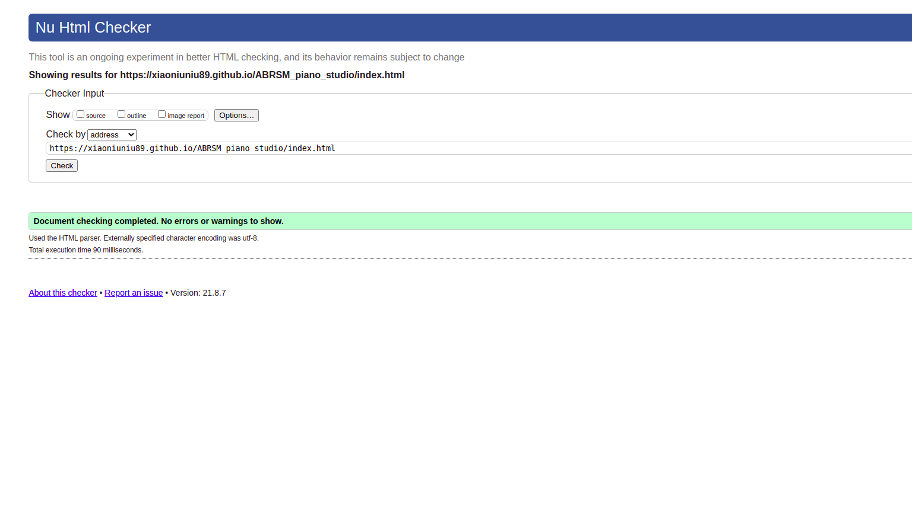
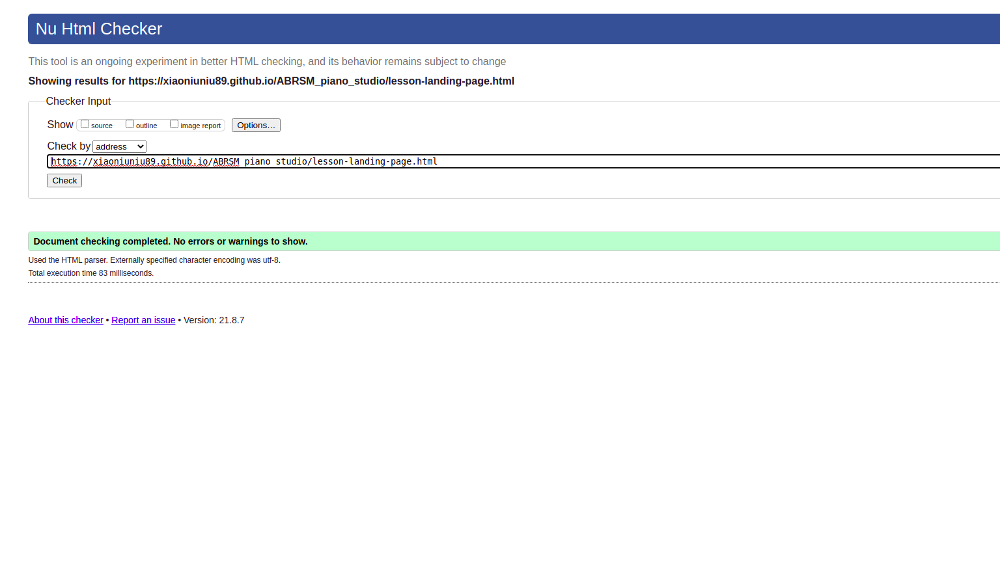
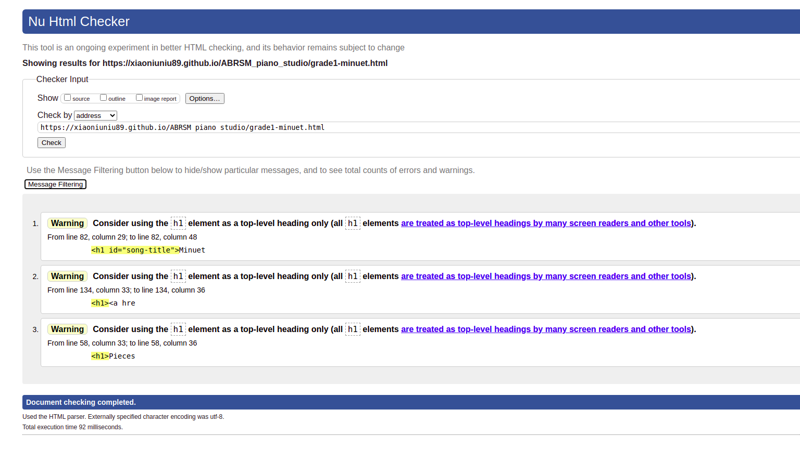
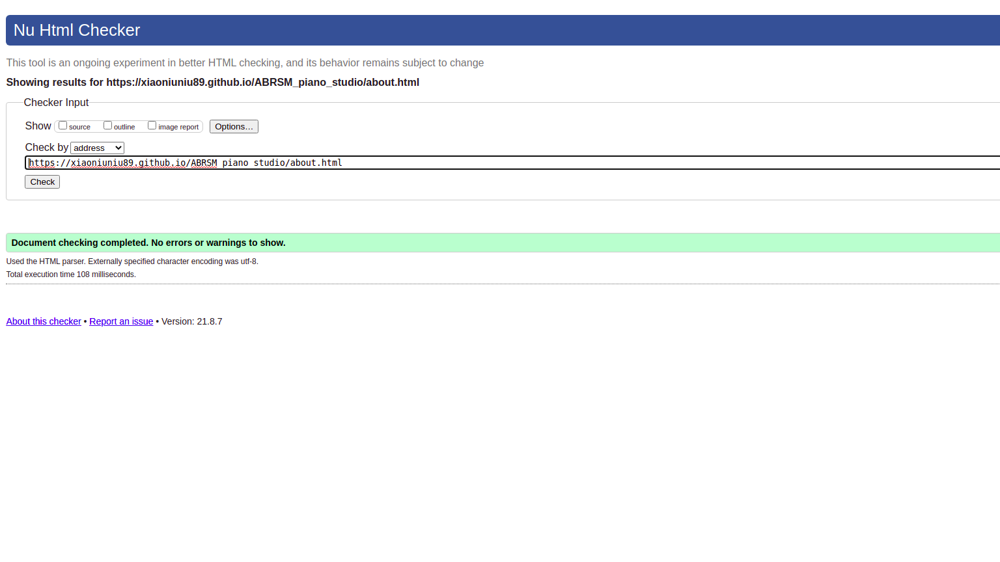
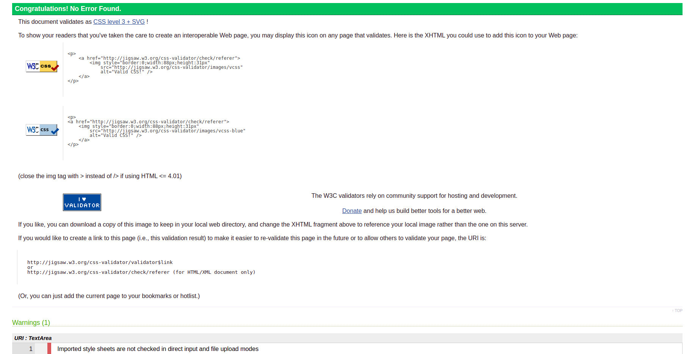

# Validator testing 

## HTML 

There were no errors found on HTML. A few warnings were left in but this was a design choice. Specifically the lesson content page needed multiple h1 headings.

- Home page

- Lesson Landing Page

- Lesson Page

- About page

## CSS

No errors on the W3C jigsaw validator

# User Stories

- As a student, I want to find relevant material for what I am studying, so that I can get help
preparing for my exam.  

  - Users can easily navigate to the lesson page from any page. 
  - click the lesson and song list relevant to them
  - subscribe link is referenced on every page. user can subscribe for weekly content.

- As a student, I want access to 100% free good quality content, so that I can continue to take
lessons with my teacher.

  - Lesson content is 100% free and no attempts are made to coerce students away from their current teachers.

- As a student, I want access to PDFs of lessons so I can print them and practice in my own time.

  - a big red lesson PDF button is at the end of each lesson. The layout is consistent on all pages so students will always know where to get the PDF. 

- As a student, I want to be kept up to date about new releases and changes in the exam syllabus
so that I can make sure what I am studying is relevant.

  - There is a chance to subscribe on each of the 3 main pages. 

- As a student, I want short videos, concise lessons so the point of the lesson does not get lost in
endless lectures by the teacher.

  - The videos are as short as possible, they can be replayed as much as needed without the need for excessive scrolling to find relevant information. There is no talking in the video, the are short and to the point.

- As a student I want more than just what to play, I want exercises to help me play the pieces
better.

  - each lesson comes with its own example exercises or tips to practice in the students own time. They are from a teacher who teaches the subject and based off common mistakes she encounters often.

- As a parent I want a safe space for my child to learn so that I don’t worry they are looking at
inappropriate content or listening to foul language.

  - Text is kept to a minimum to allow younger users to navigate without distraction. Most of the text content is in the about section and even that is free from overly complicated or dense language. 

- As a parent I want my child to have access to free content from a nice teacher as music lessons
are extremely expensive.

  - there is an about section that introduces the teacher in a friendly way. She can also be contacted through social media if the parents need. 

- As a teacher I want a website to recommend to my students that is relevant to what I teach in
class so that they will have different perspectives, structured practice time, and a better chance
of passing which will reflect positively on my own teaching experience.
  
  - lessons area all relevant and make no attempt to coerce students away from their teacher. The lessons are specifically designed for students who need to pass exams.

- As a teacher, I want ideas that I can bring to my lessons because I don't always have time to
prepare.

  - The lessons all come with exercises that could be expanded upon for an entire class if need be. They are free to teachers aswell.

- As a music school, we want a reliable, living website we can refer students to so that they can
have extra practice at home so that they will get help passing exams which will reflect well on
our school.

  - The lessons are specifically designed for students who need to pass exams.

# Responsivness
I included a lot of media queries to handle responsivness at all screen widths and can not find any major issues. The main break point is at 900px and most layout changes will happen here.

Videos of each page being tested for responsivness:
- [Home Page](https://youtu.be/_Oz8P8lBNGQ)
- [Lesson Landing Page](https://youtu.be/k1Jt58bt__k)
- [Lesson Page](https://youtu.be/kexqcdu05E8)
- [About Page](https://youtu.be/ROMKPScvxoU)
## Home page
At desktop view the Nav bar is set to the right, the logo to the left, at lower screen width these will be centered and links spaced evenly. The hero image takes up the width of the screen and becomes static at lower screen width and changes shape to a circle for phone view width. 

The welcome text is centered and responsive changing size at smaller screen widths. 

The 3 boxes are wrapped in a flex container. They are relatively positioned to get the effect of the middle box being raised on top of the two. At 900px breakpoint this effect will change to 3 rectangles simply positioned on top of each other. 

## Landing Page

The same consistant color scheme is found her for the boxes also. They are in a flex container and fully responsive. At lower screen widths they take on the style applied to the home page boxes. 3 rectangles stacked on top of each other. 

## Lesson Page

BUG: The directory folder nav link ends up in the header and I was not able to lower this without causing too many major responsivness issues. I left it with a bit of bottom margin to make it look as if it is in the header instead which I am happy with. 

The left side nav bar will not display at lower screen widths. 

The lesson content scroll box will dissapear and lesson will fill length of page at the same breakpoint as side nav bar dissapearing. 

## About 

The about page is fully responsive. It is mostly centered text and was easy to make responsive. The picture is also centered and responsive. 

# Browser Compatibility

[Google Chrome](https://www.google.com/chrome/?brand=FHFK&gclid=CjwKCAjw092IBhAwEiwAxR1lRnrDJkW2rc2m-_DsqG2ISAAChH0tbKgopfm-3BMuide3ikPssZgvWhoCsVUQAvD_BwE&gclsrc=aw.ds)
returned no bugs and responsivness was very good. 

[Firefox](https://www.mozilla.org/en-US/firefox/) had no issues and the only difference I could find was in the subscribe box on the home page. The border radius looks more pronounced and rougher here. 

[Opera](www.opera.com) The only issue I can find in opera is at 300px screen width the logo will briefly overlap the nav menu. It will fix again aroun 290px

[Edge](https://www.microsoft.com/en-us/edge) The only difference I can find here is that PDF does not open in new tab but instead in its own window which I do not think is very good for the user experience.

# Bugs 

- Clickable whitespace to the right hand side of piano nav bar.
  - This was the hardest bug to fix as I could not find a solution online. I added display relative without any values to the div containing the first key and it solved the issue. I stumbled upon this fix by accident and have no idea why it worked. 

- White space to the right hand side of page. 
  - A post on stack overflow told me to add overflow hidden to the html body. 

- Uneven boxes 
  - I learnt about flexbox and when I implimented it into the site it became much more responsive and divs were all aligned evenly. 

